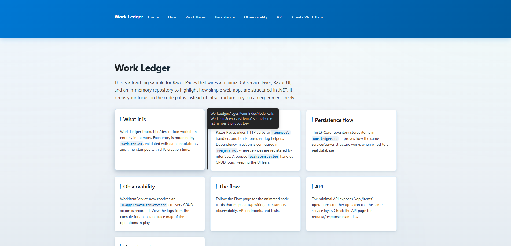
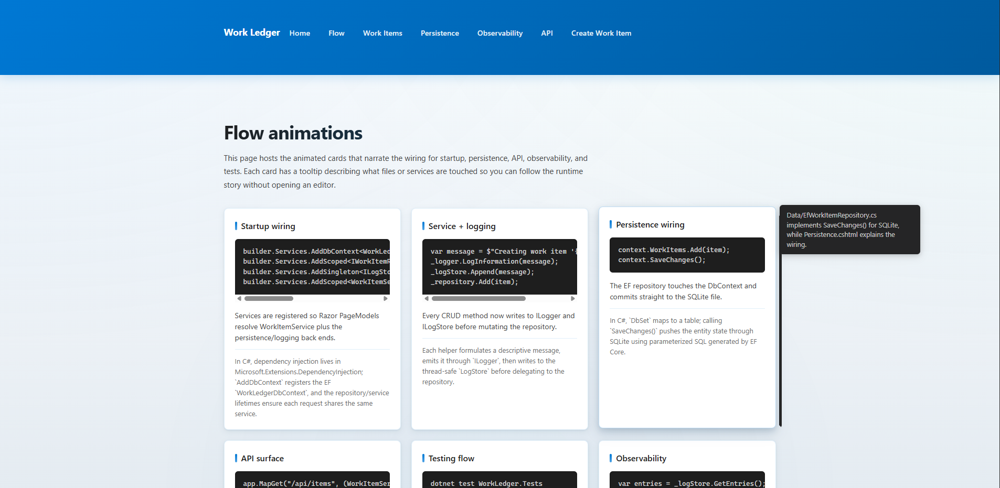
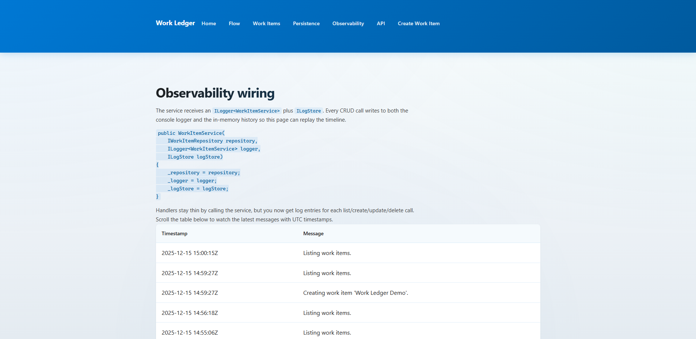
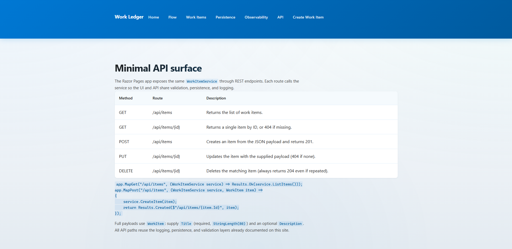
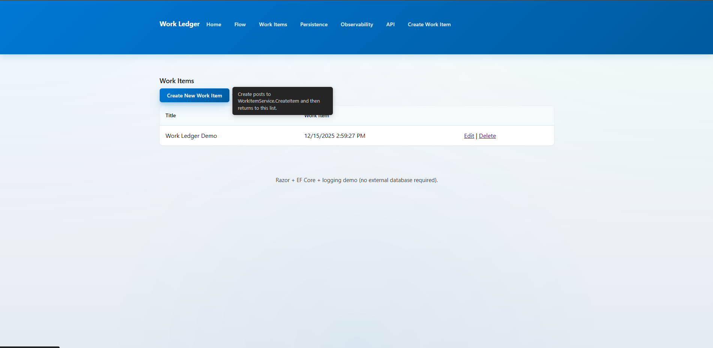
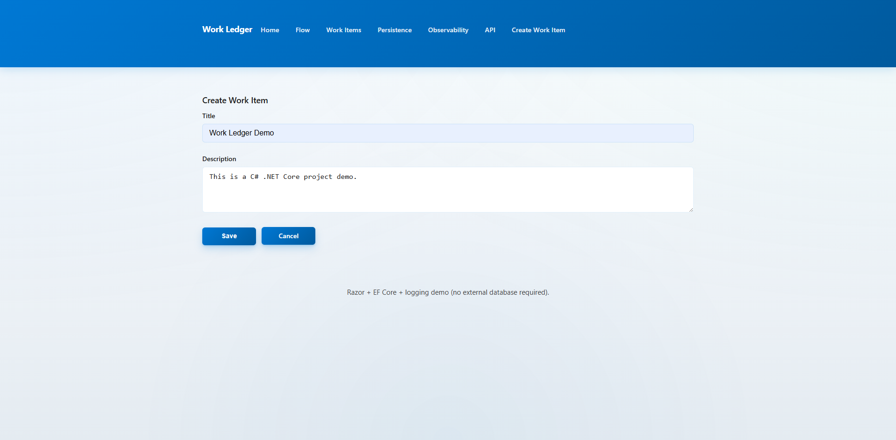
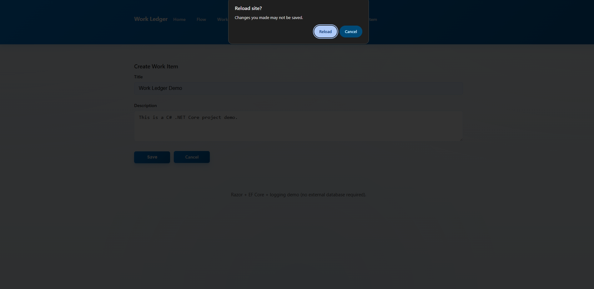

# Work Ledger

Work Ledger is a lightweight Razor Pages prototype that tracks simple work items entirely in memory. It demonstrates basic concepts of C# classes, dependency injection, Razor PageModels, and the web hosting builder so contributors can explore a full-stack .NET experience without a backing database.

## Purpose
- Showcase how a service layer (`WorkItemService`) can coordinate between Razor pages and a repository (`IWorkItemRepository`/`InMemoryWorkItemRepository`) while keeping models and validation close to the domain.
- Keep the codebase compact for teaching common C#/.NET patterns such as DI registration, `PageModel` handlers, validation via data annotations, and minimal hosting (`Program.cs`). Familiarity with basic C# syntax, nullable reference types, and Razor templates is helpful before digging deeper.
- Serve as a foundation for adding persistence, additional pages, and automated tests while the memory-backed repository keeps iterations fast.

## Project Structure
- `WorkLedger.csproj` targets `net8.0` with implicit usings and nullable reference enforcement; it drives the Razor Pages application and pulls in EF Core/SQLite, so you only need the .NET 8 runtime to run the site locally.
- `Program.cs` configures EF, logging, the repository, and the minimal API surface.
- `WorkItem.cs` defines the domain model with validation annotations (`[Required]`, `[StringLength]`) and a UTC timestamp.
- `IWorkItemRepository.cs` declares CRUD operations, and `InMemoryWorkItemRepository.cs` stores items in a simple list with incremental IDs for the default demo.
- `WorkItemService.cs` is the single business layer that front-end pages and APIs call; it now writes to both `ILogger<WorkItemService>` and `ILogStore`.
- `Data/WorkLedgerDbContext.cs` + `Data/EfWorkItemRepository.cs` describe the EF Core SQLite wiring, and `Pages/Persistence.cshtml` documents how the database is initialized and persisted.
- `Logging/ILogStore.cs`, `Logging/LogStore.cs`, and `Pages/Observability.cshtml` keep an in-memory log history that the UI can replay.
- `Pages/Items` hosts the Razor pages (`Index`, `Create`, `Edit`, `Delete`) plus their PageModels; each page injects `WorkItemService`.
- `Pages/Index.cshtml` keeps an interactive home experience with tiles for persistence, observability, flow, API, and the extended tour text.
- `Pages/Flow.cshtml`, `Pages/Api.cshtml`, and `Pages/Testing.cshtml` publish the animated code cards, the minimal API reference, and the xUnit coverage explanation; Flow cards now include hover hints and support double-click expansion for easier reading.
- `AGENTS.md` and `project_scaffold.txt` outline contributor norms and scaffolding ideas.

## Configuration
1. Ensure the machine uses a .NET 8 SDK (or higher) so the net8.0 target restores/builds; if the repo already ships with a local SDK under `<PATH>/.dotnet`, prefix commands as `<PATH>/.dotnet/dotnet`.
2. Run `<PATH>/.dotnet/dotnet restore` if dependencies change (currently no extra packages are needed).
3. Use `<PATH>/.dotnet/dotnet run` from the repo root to start the Razor Pages app; it listens on the IIS Express defaults unless you override with `ASPNETCORE_URLS`.
4. Add tests in a new `WorkLedger.Tests` project and invoke `<PATH>/.dotnet/dotnet test` after you add scenarios.
5. The sample now targets `net8.0`, so make sure the .NET 8 SDK/runtime is installed before running or testing the app.

## Getting Familiar
- Read through `Pages/Items/Index.cshtml.cs` to see how Razor PageModels call `WorkItemService` in `OnGet`, `OnPost`, and other handlers.
- Inspect `WorkItem.cs` and the repository implementation to understand how validation and CRUD behavior live in parallel.
- The UI in `Pages/Items/*.cshtml` shows how forms bind to the `WorkItem` DTO; every label already has collected hints to explain requirements.
- Visit `Pages/Persistence.cshtml` for the EF/SQLite wiring, `Pages/Observability.cshtml` for the log replay, `Pages/Flow.cshtml` for the animated code cards, and `Pages/Api.cshtml` for the minimal REST surface.
- When adding new functionality, introduce a `.tile` with a tooltip plus a Flow card (or Flow page entry) so the home page and guided tour documentation stay aligned.

Feel free to layer EF, APIs, or logging onto this scaffolding; the separate tiles/pages keep each concern visible.

The Create work-item form now prompts before you cancel, close, or navigate away if there’s unsaved data so you don’t lose typed work accidentally.

## Screenshots

_The guide tiles on the home page highlight the flow for persistence, observability, and CRUD with a shared tooltip position._

_The Flow page narrates the wiring for startup, persistence, logging, API, and testing with animated cards and focused tooltips._

_Observability replays each CRUD action via `ILogStore`, enabling a live timeline of service calls._

_The minimal API section documents the GET/POST/PUT/DELETE routes that reuse `WorkItemService` so clients and the UI share behavior._

_The `/Items` page lists work items, wired to `WorkItemService.ListItems()` with tag-helper driven forms._

_Create a new work item via the form that posts to `WorkItemService.CreateItem` while validating Title/Description metadata._

_Leaving the Create page prompts if the form has unsaved content so you don’t accidentally lose typed work._

## Tests
- `WorkLedger.Tests` exercises the in-memory repository through `WorkItemService`, keeping service logic verifiable without launching the UI.
- `EfWorkItemRepositoryTests` validate the SQLite-backed persistence implementation via an in-memory SQLite connection.
- `LogStoreTests` proves the logging history holds the most recent messages so Observability can replay the actions.
- Run `<DOTNET_ROOT>/dotnet test` (or `dotnet test`) to execute the suite before pushing changes.
